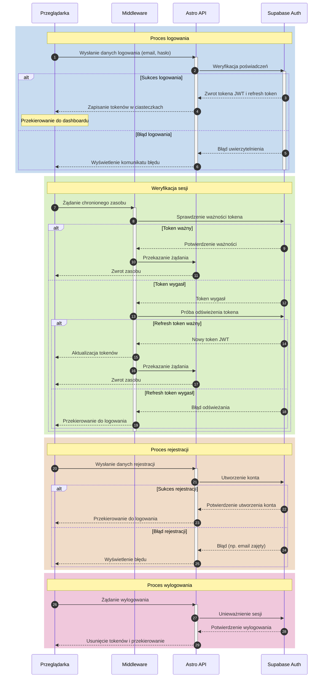

<mermaid_diagram>

```mermaid
sequenceDiagram
    autonumber

    participant P as Przeglądarka
    participant M as Middleware
    participant A as Astro API
    participant S as Supabase Auth

    %% Logowanie
    rect rgb(200, 220, 240)
        Note over P,S: Proces logowania
        P->>A: Wysłanie danych logowania (email, hasło)
        activate A
        A->>S: Weryfikacja poświadczeń
        activate S
        alt Sukces logowania
            S-->>A: Zwrot tokena JWT i refresh token
            A-->>P: Zapisanie tokenów w ciasteczkach
            Note over P: Przekierowanie do dashboardu
        else Błąd logowania
            S-->>A: Błąd uwierzytelnienia
            A-->>P: Wyświetlenie komunikatu błędu
        end
        deactivate S
        deactivate A
    end

    %% Weryfikacja sesji
    rect rgb(220, 240, 200)
        Note over P,S: Weryfikacja sesji
        P->>M: Żądanie chronionego zasobu
        activate M
        M->>S: Sprawdzenie ważności tokena
        alt Token ważny
            S-->>M: Potwierdzenie ważności
            M->>A: Przekazanie żądania
            A-->>P: Zwrot zasobu
        else Token wygasł
            S-->>M: Token wygasł
            M->>S: Próba odświeżenia tokena
            alt Refresh token ważny
                S-->>M: Nowy token JWT
                M-->>P: Aktualizacja tokenów
                M->>A: Przekazanie żądania
                A-->>P: Zwrot zasobu
            else Refresh token wygasł
                S-->>M: Błąd odświeżania
                M-->>P: Przekierowanie do logowania
            end
        end
        deactivate M
    end

    %% Rejestracja
    rect rgb(240, 220, 200)
        Note over P,S: Proces rejestracji
        P->>A: Wysłanie danych rejestracji
        activate A
        A->>S: Utworzenie konta
        alt Sukces rejestracji
            S-->>A: Potwierdzenie utworzenia konta
            A-->>P: Przekierowanie do logowania
        else Błąd rejestracji
            S-->>A: Błąd (np. email zajęty)
            A-->>P: Wyświetlenie błędu
        end
        deactivate A
    end

    %% Wylogowanie
    rect rgb(240, 200, 220)
        Note over P,S: Proces wylogowania
        P->>A: Żądanie wylogowania
        activate A
        A->>S: Unieważnienie sesji
        S-->>A: Potwierdzenie wylogowania
        A-->>P: Usunięcie tokenów i przekierowanie
        deactivate A
    end
```

</mermaid_diagram>
